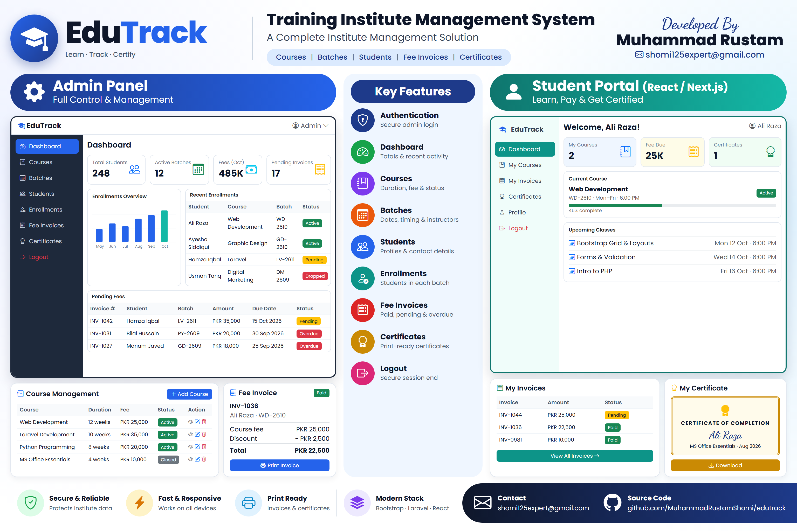
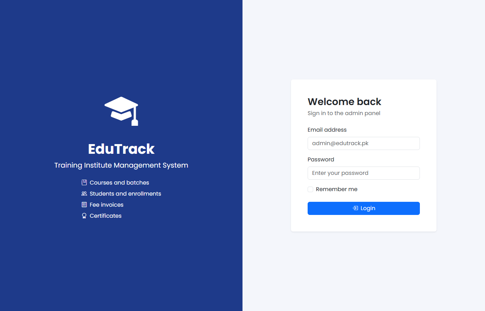
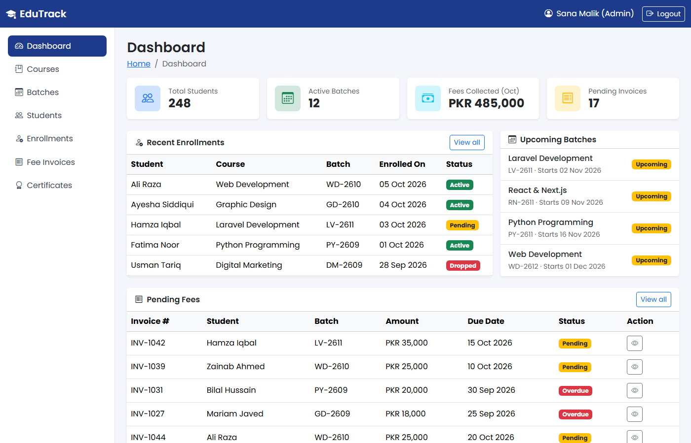
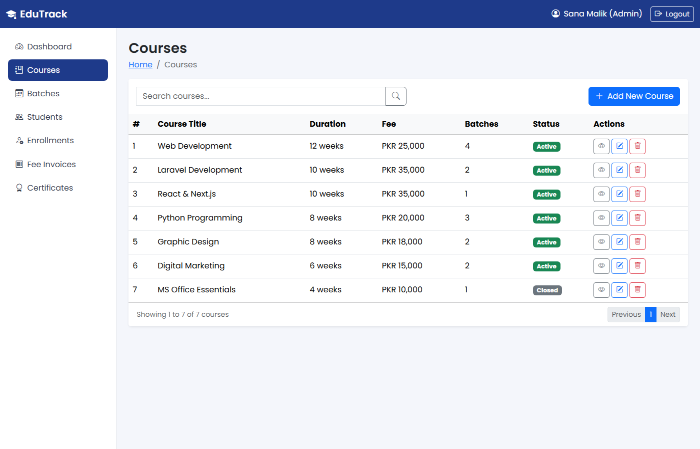
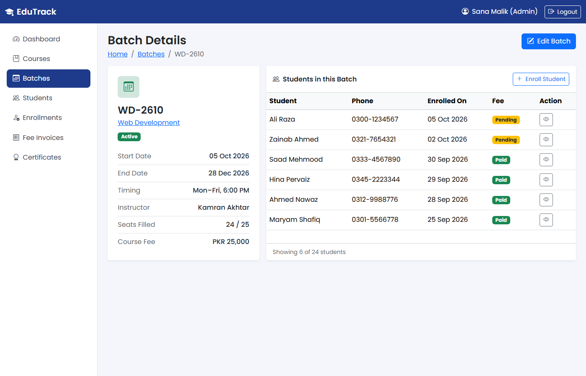
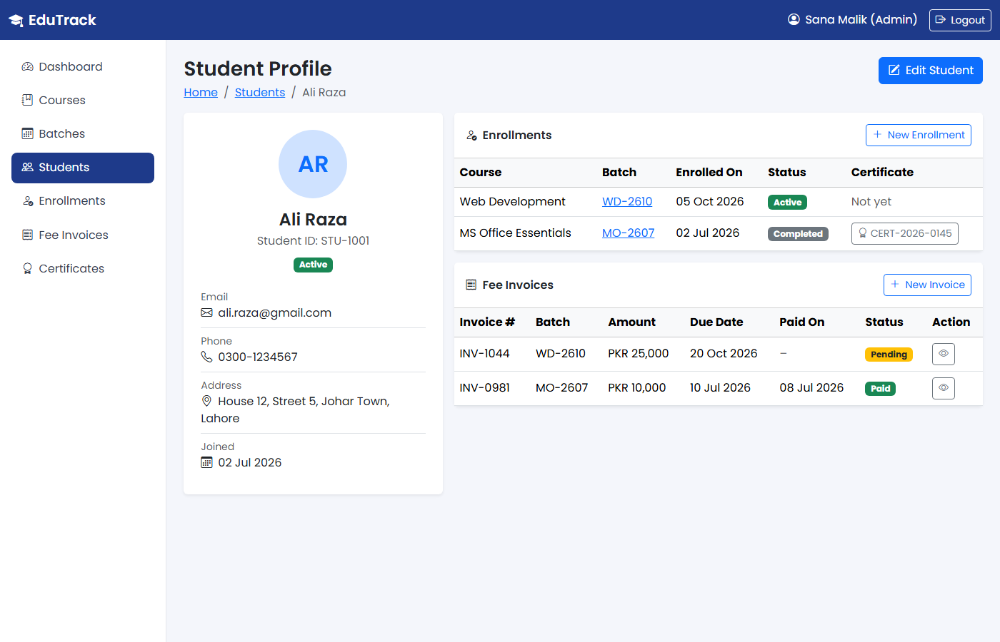
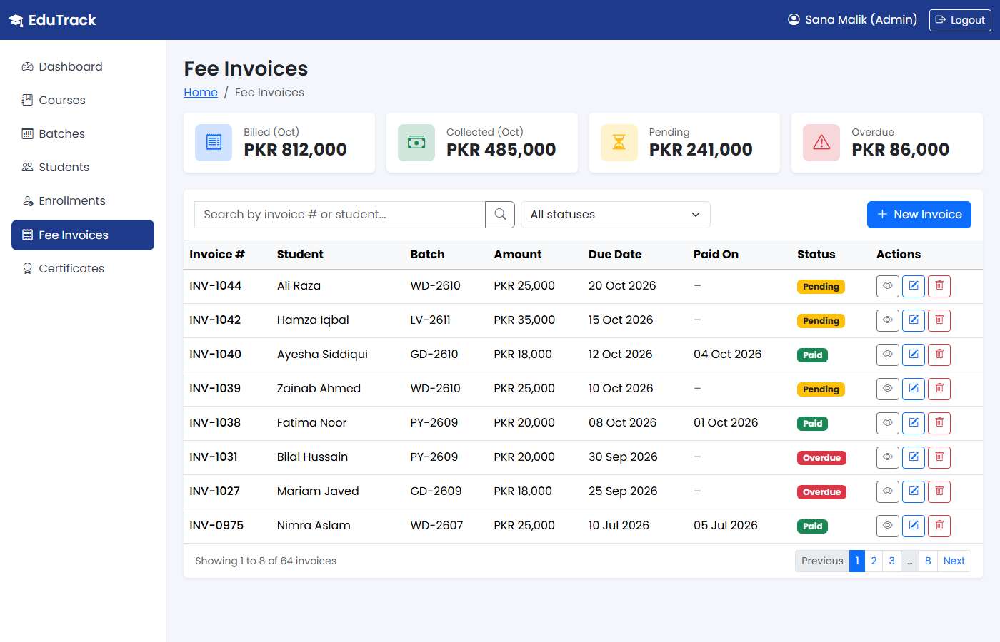
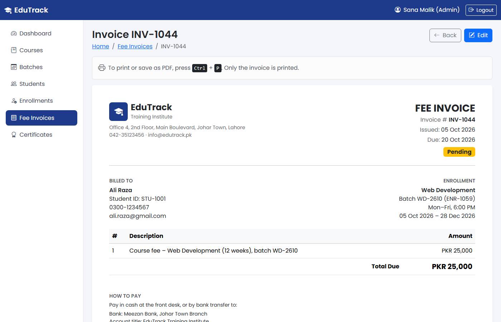
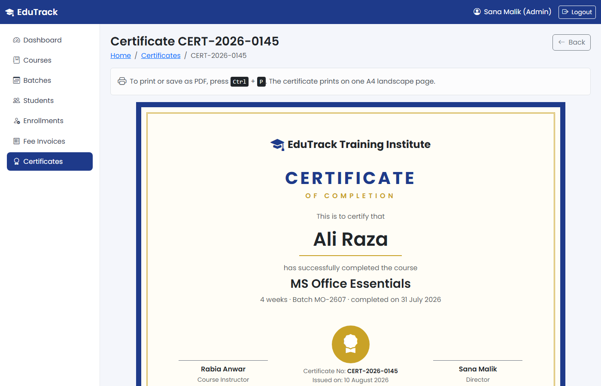
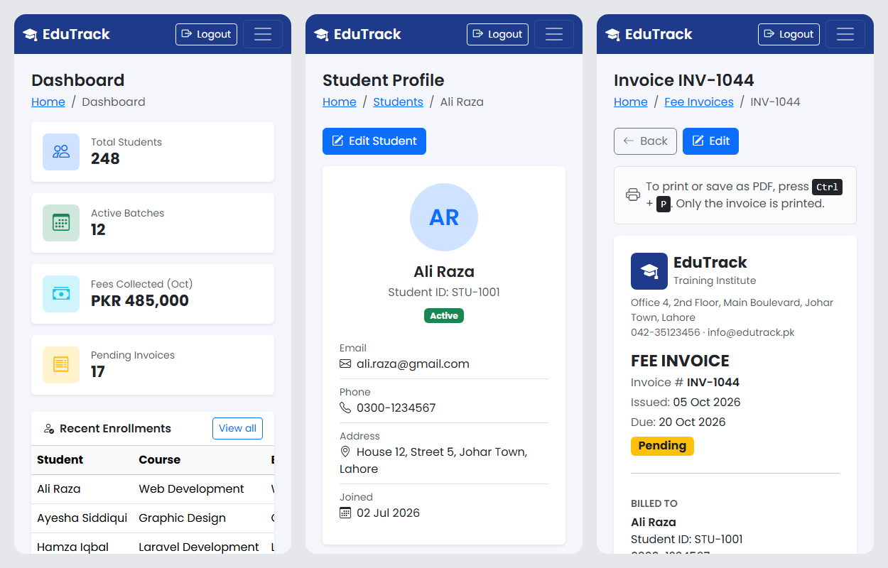

# EduTrack: Training Institute Management System

An admin panel for a training institute. It manages **courses, batches,
students, enrollments, fee invoices and certificates**.

Built as a course assignment by **Muhammad Rustam**
(shomi125expert@gmail.com).



## Project status

| Phase | What | Tech | Status |
|---|---|---|---|
| 1 | Static frontend of the admin panel | HTML, CSS, Bootstrap 5.3, Bootstrap Icons | **Done** |
| 2 | Backend with database | Laravel, MySQL (XAMPP) | Next |
| 3 | Student portal | React / Next.js | Later |

Phase 1 is plain HTML and Bootstrap only: no custom JavaScript and no build
tools. Search boxes, filters and forms are visual for now. They start working
when the Laravel backend is added in Phase 2.

## Modules

| Module | What it manages | Pages |
|---|---|---|
| Login | Admin sign in | `index.html` |
| Dashboard | Totals, recent enrollments, upcoming batches, pending fees | `dashboard.html` |
| Courses | Course title, duration, fee, status | `courses.html`, `course-add.html`, `course-view.html` |
| Batches | A run of a course: dates, timing, instructor, seats | `batches.html`, `batch-add.html`, `batch-view.html` |
| Students | Student profile and contact details | `students.html`, `student-add.html`, `student-view.html` |
| Enrollments | Which student is in which batch | `enrollments.html`, `enrollment-add.html` |
| Fee Invoices | Fee amount, due date, paid / pending / overdue | `invoices.html`, `invoice-add.html`, `invoice-view.html` |
| Certificates | Certificates for students who completed a course | `certificates.html`, `certificate-view.html` |

18 pages in total. Invoices and certificates print cleanly with **Ctrl + P**
(the certificate prints on one A4 landscape page).

## Screenshots

### Login


### Dashboard


### Courses


### Batch details


### Student profile


### Fee invoices


### Printable fee invoice


### Printable certificate


### On a phone


## How to open the project

### Option 1: with XAMPP (recommended)

1. Install [XAMPP](https://www.apachefriends.org/) and start **Apache** from
   the XAMPP Control Panel.
2. Get the code into the `htdocs` folder.

   PowerShell or Git Bash:

   ```
   cd C:\xampp\htdocs
   git clone https://github.com/MuhammadRustamShomi/edutrack.git
   ```

3. Open <http://localhost/edutrack/frontend/> in your browser.
4. Click **Login** (any email and password works in Phase 1).

### Option 2: without a server

Download the code (**Code → Download ZIP** on GitHub), unzip it and open
`frontend/index.html` in your browser. If the Login button does not open the
dashboard this way, open `frontend/dashboard.html` directly.

An internet connection is needed for the icons and the Poppins font. Bootstrap
itself is included in `frontend/bootstrap/`.

## Folder structure

```
edutrack/
├── README.md
├── PLAN.md                  # page list, database plan, schedule, checklist
├── project-details.png      # Assignment 01 image
├── screenshots/             # images used in this README
├── frontend/                # Phase 1: static HTML + Bootstrap
│   ├── index.html           # login page
│   ├── dashboard.html
│   ├── courses.html ...     # one list / add / view page per module
│   ├── bootstrap/           # Bootstrap 5.3.8 (css/ and js/)
│   ├── css/style.css        # the only custom stylesheet
│   └── images/
└── backend/                 # Phase 2: Laravel app goes here
```

## Built with

- [Bootstrap 5.3](https://getbootstrap.com/) for layout and components
- [Bootstrap Icons](https://icons.getbootstrap.com/) for icons
- [Poppins](https://fonts.google.com/specimen/Poppins) from Google Fonts

All sample names, phone numbers, emails and bank details in the pages are made
up for demonstration.
